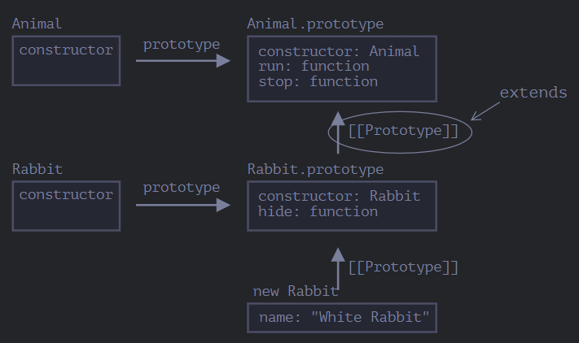

# Datatypes

## Numbers

More ways to write numbers

```js
let billion = 1000000000;

let billion2 = 1_000_000_000;
```

💡Note: We can use the letter `e` to specify the zero count.

```js
let billion = 1e9;

alert(7.3e9); // 7.300000000
```

> It can be used to put decimals also.

```js
let num = 0.000001

let num = 1e-6;
```

### Rounding

* math.floor - 3.1 becomes 3
* math.ceil - 3.1 becomes 4
* math.round - 3.1 becomes 3
* math.round - 3.5 becomes 4
* math.trunc - 3.1 becomes 3
* math.trunc - 3.6 becomes 3

----

<br>

## Declare String Varibles

```js
var firstName = "Alan";
console.log(firstName);

var myFirstName = "Adarsh";
console.log(myFirstName);
```

## Escaping literal quotes in Strings

```js
var myStr = "Hi, my name is \"Adarsh Anand\"";
//use "\" to escape the quote
console.log(myStr);
var myStr = 'Hi, my name is "Adarsh Anand"';
// or use ' to escape the double quote
```

## Map and Set

Map is a collection of keyed data items, just like an Object. But the main difference is that Map allows keys of any type.

Methods and properties are:

* **`new Map()`** – creates the map.
* **`map.set(key, value)`** – stores the value by the key.
* **`map.get(key)`** – returns the value by the key, undefined if key doesn’t exist in map.
* **`map.has(key)`** – returns true if the key exists, false otherwise.
* **`map.delete(key)`** – removes the value by the key.
* **`map.clear()`** – removes everything from the map.
* **`map.size`** – returns the current element count.

```js
let map = new Map();

map.set('1', 'str1');   // a string key
map.set(1, 'num1');     // a numeric key
map.set(true, 'bool1'); // a boolean key

// Map keeps the type, so these two are different:
alert( map.get(1)   ); // 'num1'
alert( map.get('1') ); // 'str1'

alert( map.size ); // 3
```

## Date and Time

To create a new Date object call `new Date()` with one of the following arguments:

```js
let now = new Date();
alert( now ); // shows current date/time
```

```js
new Date(2011, 0, 1, 0, 0, 0, 0); // 1 Jan 2011, 00:00:00
new Date(2011, 0, 1); // the same, hours etc are 0 by default

let date = new Date(2011, 0, 1, 2, 3, 4, 567);
alert( date ); // 1.01.2011, 02:03:04.567
```

## Class

Basic syntax for creating a class:

```js
class MyClass {
  // class methods
  constructor() { ... }
  method1() { ... }
  method2() { ... }
  method3() { ... }
  ...
}
```

### Class Inheritance

```js
class Animal {
  constructor(name) {
    this.speed = 0;
    this.name = name;
  }
  run(speed) {
    this.speed = speed;
    alert(`${this.name} runs with speed ${this.speed}.`);
  }
  stop() {
    this.speed = 0;
    alert(`${this.name} stands still.`);
  }
}

let animal = new Animal("My animal");

// now create rabbit class that inherits from Animal.

`extends` keyword is used to inherit from the Animal class.

class Rabbit extends Animal {
  hide() {
    alert(`${this.name} hides!`);
  }
}

let rabbit = new Rabbit("White Rabbit");

rabbit.run(5); // White Rabbit runs with speed 5.
rabbit.hide(); // White Rabbit hides!
```
