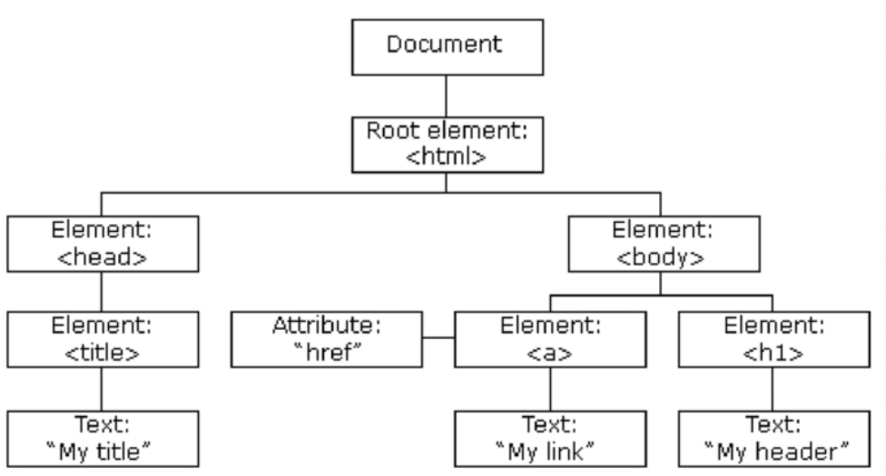

# Dom Manipulation



```html
<!DOCTYPE html>
<html>
<head>
<title>JavaScript + DOM</title>
<link rel="stylesheet" type="text/css" href="style.css">
</head>
<body>
    <h1>Shopping List</h1>
    <p id="first">Get it done today</p>
    <p class="second">No excuses</p>
    <ul>
        <li random="23">Milk</li>
        <li>Eggs</li>
        <li>Bread</li>
    </ul>
</body>
</html>
```

<br>

## Interaction: alert, prompt, confirm

```js
alert("Hello World"); //invoke an alert box

result = prompt(title, [default]);
// It shows a modal window with a text message.

let age = prompt('How old are you?', 100);
alert(`You are ${age} years old!`); 
// You are 100 years old!

let isAdmin = confirm("Are you the Admin?");
alert( isAdmin ); // true if OK is pressed
```

## Change all the HTML elements

**DOM Selectors**

```js
getElementById()
getElementsByClassName()
getElementsByTagName()
```

```js
document.getElementByTagName("h1");
> Shopping List

document.getElementByClassName("second");
> No excuses

document.getElementByID("first");
> Get it done today
```

**Query Selector**

Query Selector is a method that allows you to select a single element from the DOM. Query Selector All is a method that allows you to select multiple elements from the DOM.

```js
querySelector()
querySelectorAll()
```

```js
document.querySelector("li");
> <li random="23">Milk</li>

document.querySelectorAll("li");
> [<li random="23">Milk</li>, <li>Eggs</li>, <li>Bread</li>]
```

<br>

##  Change all the HTML attributes in the page

**Attribute Selectors**

```js
getAttribute()
setAttribute()
```

```js
document.querySelector("li").getAttribute("random");
> 23

document.querySelector("li").setAttribute("random", "100");

document.querySelector("li");
> <li random="100">Milk</li>
```

<br>

## Change all the CSS styles in the page

**Changing Styles**

```js
style.{property}

className
classList

classList.add()
classList.remove()
classList.toggle()
```

## Remove existing HTML elements and attributes

## Add new HTML elements and attributes

## JavaScript can react to all existing HTML events in the page.

## JavaScript can create new HTML events in the page.